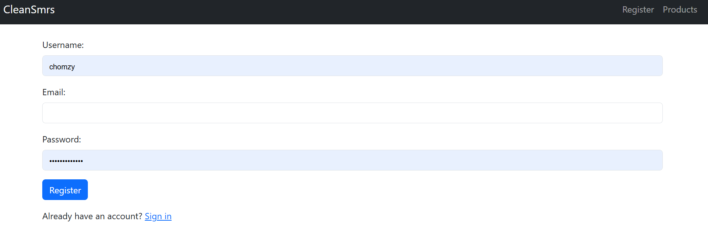
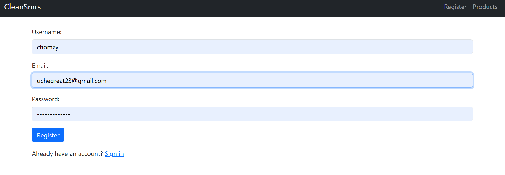
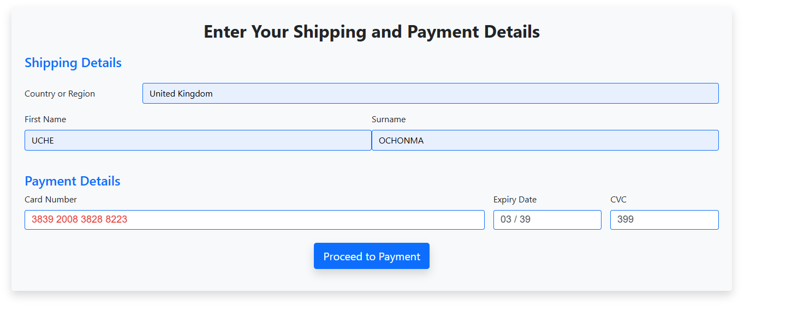

# Cleansmrs

Cleansmrs is a responsive e-commerce web application built with Django. It allows users to browse products, create accounts, and complete secure payments through Stripe.

## Features

- User registration and authentication
- Product management
- Shopping and transaction management
- Secure Stripe payment integration
- Responsive interface built with Bootstrap
- Cross-device compatibility

## Technologies

- Python
- Django
- Bootstrap
- Stripe
- SQLite/PostgreSQL

## My Contribution

This was a group project, and I completed the majority of the development work. My main responsibilities included:

- Developing the core Django backend logic
- Implementing user authentication
- Managing product and transaction functionality
- Integrating Stripe payments
- Building and styling responsive pages with Bootstrap
- Testing features and resolving application issues

The project was developed collaboratively using Agile/Scrum practices, with iterative planning, development, testing, and improvements.

## Installation

```bash
git clone https://github.com/uchegreat/cleansmrs.git
cd cleansmrs

python -m venv venv
venv\Scripts\activate

pip install -r requirements.txt
python manage.py migrate
python manage.py runserver
```

Open the application at:

```text
http://127.0.0.1:8000/
```

## Environment Variables

Create a `.env` file and add your configuration:

```env
SECRET_KEY=your_django_secret_key
STRIPE_PUBLIC_KEY=your_stripe_public_key
STRIPE_SECRET_KEY=your_stripe_secret_key
```
*keys are publicly displayed in the files*

Do not commit private keys or sensitive credentials to the repository.

## Project Status

Completed as a collaborative academic/group project.

## Screenshots

### Home Page


### Sign in Page



### Sign Up Page



### Dashboard


### Results



### Additional Screenshot


## Author

**Uche Great**
